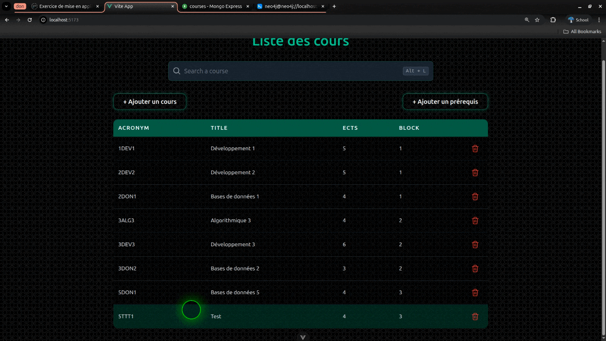

# PAE-Sync

A multi-database *academic program manager (PAE)* built with Spring Boot and Vue.js.

---

## Overview

**PAE-Sync** (Programme Annuel des Études – “Annual Study Program”) is a web application designed to help manage university course programs and their prerequisites.  
It demonstrates how to synchronize and manage data across **multiple databases** — MongoDB, Neo4j, and Elasticsearch — within a unified Spring Boot backend.

This project is an evolution of a previous PAE web app that used Spring Boot, Thymeleaf, and H2.  
While the original focused on CRUD and data validation, **PAE-Sync** explores **multi-model persistence** — using the best database type for each kind of data.

---

## Architecture

| Layer | Technology | Purpose |
|-------|-------------|----------|
| **Frontend** | Vue.js | Dynamic and reactive user interface |
| **Backend** | Spring Boot | REST API and synchronization logic |
| **Database 1** | MongoDB | Stores course metadata |
| **Database 2** | Neo4j | Stores prerequisite relationships between courses |
| **Database 3** | Elasticsearch | Provides advanced search and fuzzy matching |

---

## Demo

A few highlights of **PAE-Sync** in action — showing how courses are created, synchronized, and queried across multiple databases.

### Adding a Course

  

---

### Data Synchronization (MongoDB + Neo4j)

  

---

### Adding a Prerequisite

  

---

### Prerequisite Proof in Neo4j

  

---

### Fuzzy Search (Elasticsearch)

  

---
